# pituto

**Cinco mods que le quitan el roce a Claude Code.**

Responde las preguntas de Claude con un clic. Cita el párrafo exacto. Compactar, limpiar y effort a un botón. Sabes en qué proyecto estás por el color. Las tablas anchas siguen siendo tablas.

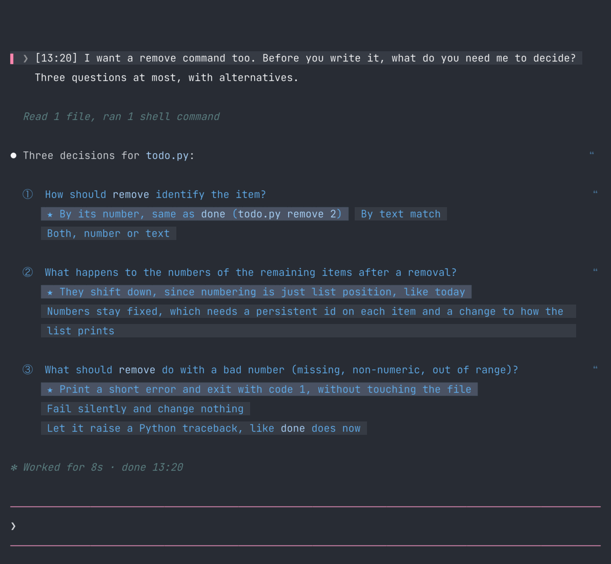

```bash
claude plugin marketplace add betoescobar46/pituto
claude plugin install inline-replies@pituto     # o cualquiera de los cinco
```

Después reinicia Claude Code (`/exit`, `claude --continue`). Todas las capturas de abajo son reales: dos sesiones idénticas, una con los mods apagados y otra con los mods encendidos.

---

## Responder las preguntas de Claude

Claude enumera cuatro decisiones. Tú las relees y escribes una respuesta que apunta a cada una por número: "1: both… 4: several…".

**Antes**

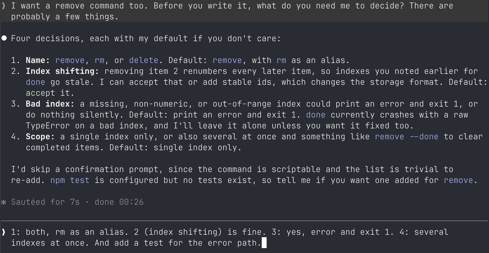

**Con `inline-replies`**

Las preguntas quedan como enlaces donde aparecen. Clic en **①** abre tu línea de respuesta; clic en una alternativa, dibujada como tecla en su propia línea, y queda escrita. Abajo agregas lo que quieras. Las preguntas sin responder toman la opción que Claude recomendó, marcada con ★.

**El silencio nunca autoriza algo irreversible.** Una pregunta sobre borrar, hacer push, enviar, pagar o sobrescribir nunca trae opción recomendada: se contesta explícitamente.

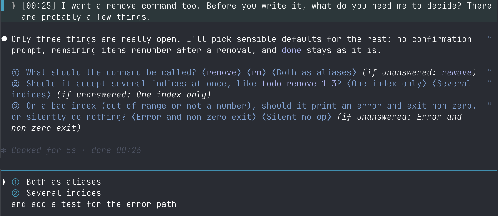

Todo queda en el prompt como texto. Lo editas y Enter.

## Apuntar a una parte de la respuesta

**Antes**

Seleccionar, copiar, pegar entre comillas y esperar que Claude entienda a qué párrafo te refieres.

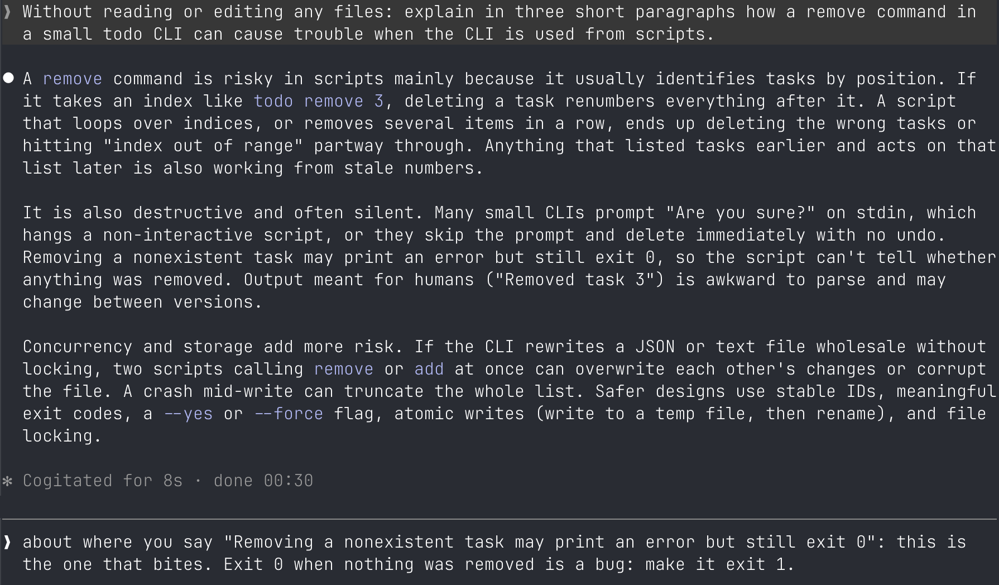

**Con `inline-replies`**

Cada párrafo tiene un **❝** al margen. Clic y una pista de una línea entra al prompt; Claude recibe el párrafo completo, en orden, con tu comentario. Marca texto con el mouse y aprieta **❝+** para citar exactamente eso.

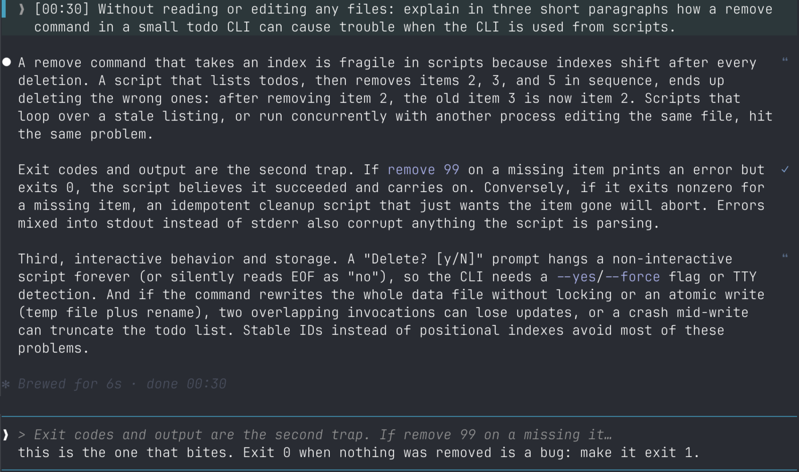

## Compactar, limpiar, effort, modelo

**Antes**

Acordarse del comando, escribirlo, elegirlo de un menú.

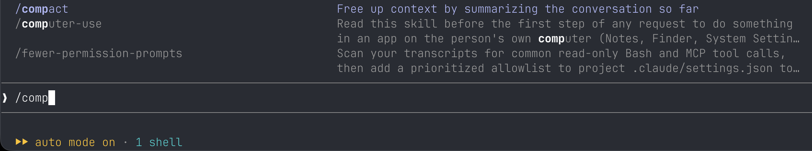

**Con `session-bar`**

Un botón para cada cosa, bajo el prompt. **C** compacta (el segundo clic confirma y un porcentaje muestra el avance). **⌫** limpia (segundo clic confirma; no tiene vuelta). **L M H XH Mx** fija el effort y el nombre del modelo abre el selector: ambos cambian el ajuste real de Claude Code (lo que muestra `/model`) y, igual que escribir `/effort` o `/model`, lo guardan como default de las sesiones nuevas. Con la opción `keepDefaults` en `on` el clic vale solo para esta sesión: el mod devuelve el default anterior en `~/.claude/settings.json` después de cada clic (si otra sesión guarda esas mismas claves en esos segundos, ese cambio se puede perder). Si los cambias en `/model` o `/effort`, la barra los sigue. **◧** abre un chat lateral para una pregunta suelta que no interrumpe la tarea.

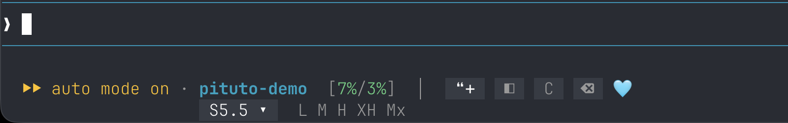

## Saber dónde estás

**Antes**

Cuatro terminales, cuatro Claude Code, todos iguales.

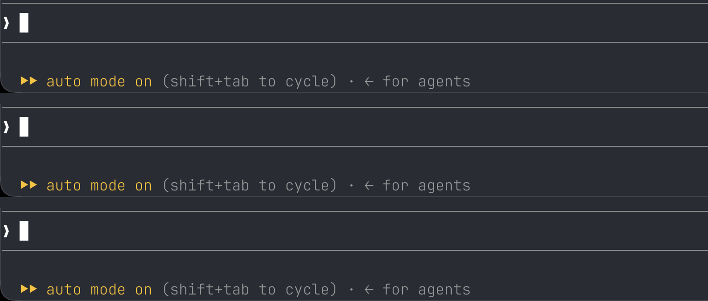

**Con `session-bar`**

Cada carpeta tiene su color: la línea del prompt, el nombre y el punto. Mañana abres una sesión en esa carpeta y sale del mismo color. Fija los que te importan en `/config`, o en `settings.json`:

```jsonc
// ~/.claude/settings.json
"pluginConfigs": {
  "session-bar@pituto": { "options": { "folderColors": "api=cyan, shop=purple, admin=orange" } }
}
```

Las demás carpetas reciben un color propio y estable, nunca uno de los fijos.

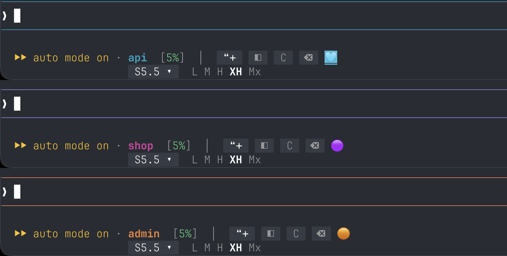

## Tablas anchas

**Antes**

Cuando una tabla no cabe, Claude Code se rinde y la imprime como lista vertical. Comparar seis opciones en seis criterios se vuelve un scroll.

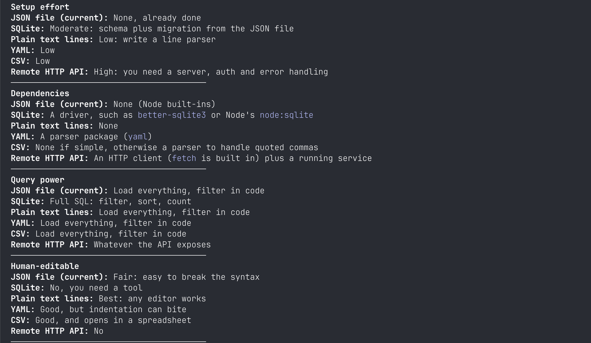

**Con `grid-tables`**

La tabla sigue siendo tabla. Cada columna recibe el ancho que piden sus palabras y el resto se reparte, así que las celdas cortan por palabra.

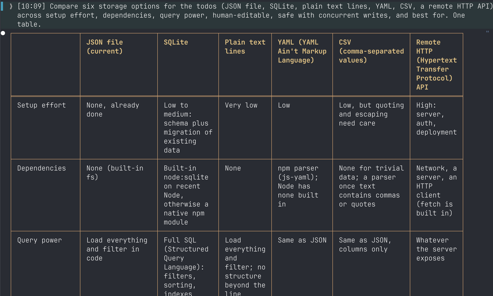

## Leer la conversación

**Antes**

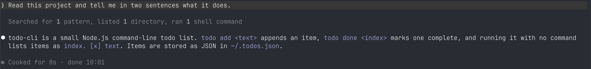

**Con `quiet-lines` y `message-times`**

El resumen de herramientas y la línea "Worked for" quedan tenues y en cursiva: lo que ves es la respuesta. Cada mensaje tuyo lleva la hora en que lo mandaste.

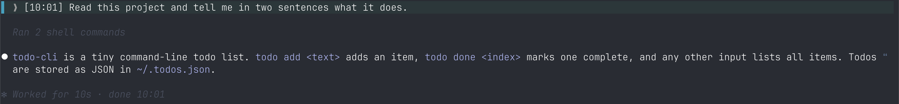

---

## Los cinco mods

| Mod | En una línea |
|---|---|
| `inline-replies` | Preguntas que respondes con un clic; párrafos que citas con un clic |
| `session-bar` | Chat lateral, compactar, limpiar, effort, modelo y un color por carpeta |
| `grid-tables` | Tablas markdown como grilla a cualquier ancho |
| `quiet-lines` | Líneas secundarias en cursiva tenue |
| `message-times` | La hora junto a cada mensaje tuyo |

Se instalan por separado o todos juntos. No dependen entre sí.

## Opciones

Todas están en `/config`, bajo el nombre del mod.

| Mod | Opción | Qué hace |
|---|---|---|
| `inline-replies`, `session-bar` | `language` | `auto` sigue el ajuste `language` de Claude Code (o el idioma del sistema): español queda en español, cualquier otro sale en inglés. `en` o `es` lo fijan. |
| `session-bar` | `folderColors` | Los colores fijos de arriba. |
| `session-bar` | `persona` | Una frase que se agrega al chat lateral suelto, por ejemplo "El usuario es cardiólogo: responde lo clínico a nivel de especialista." |

## Notas

- Funciona en cualquier terminal. Probado en cmux y Ghostty en macOS.
- MIT.

*Hecho en Chile.* — [English](README.md)
